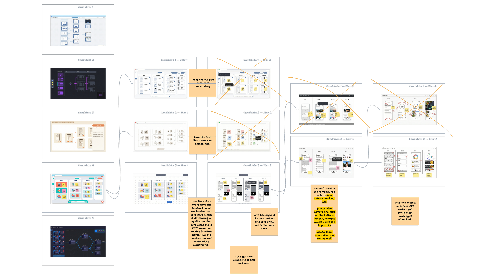
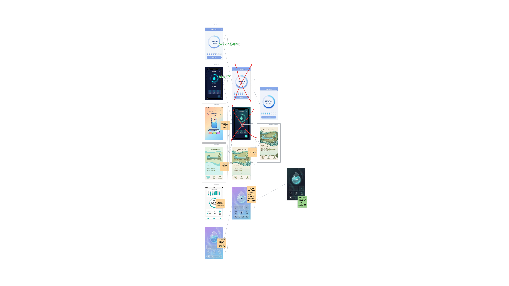
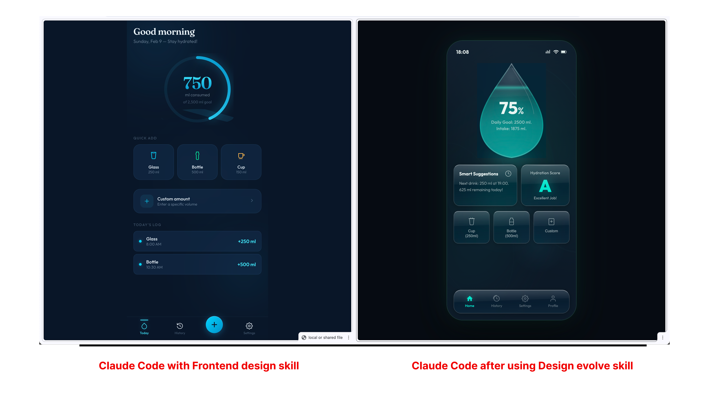

# /design-evolve

An experimental skill for iterative visual design exploration using AI. This is the companion tool to [Learning to Draw Again With AI](https://thoughts-and-experiments.github.io/Possibilities-Article/) — an essay on divergence, taste, and visual exploration in AI-native design workflows.

## What is this?

Design Evolve is a Claude Code skill that runs an iterative design loop on a [tldraw](https://github.com/tldraw/tldraw) canvas. Instead of prompting for a single output and refining it line by line, you explore a broad space of visual possibilities and converge through curation.

The workflow:

```
SEED → REVIEW → EVOLVE → REVIEW → EVOLVE → ... → CONVERGE
```

1. **Seed** — Describe what you want. The skill generates multiple diverse UI candidates using image generation.
2. **Review** — Annotate directly on the canvas. Circle what you like, cross out what you don't, add sticky notes with feedback.
3. **Evolve** — The skill reads your annotations and evolves all candidates, applying your feedback globally.
4. **Converge** — Repeat until you're happy, then export as code, design specs, or a polished image.

## Examples

### Exploring candidates with annotations

The skill generates seed candidates, and you annotate them with visual feedback directly on the tldraw canvas. Feedback on any candidate is applied to all candidates in the next evolution round.



### Iterating towards convergence

Each evolution round applies your feedback and branches into new variations. Over multiple rounds, the designs converge towards a unified direction.



### Final output

Once you're satisfied, the skill can export your chosen design as HTML/CSS, a React component, design specs, or a polished high-resolution image.



## Quick Start — Paste this repo link into Claude Code

The fastest way to get started: **paste this repo's URL into a Claude Code chat.** Claude will read this README and walk you through setup, asking permission at each step.

Alternatively, follow the manual steps below.

## Setup

### Prerequisites

- **Node.js 18+**
- **[bun](https://bun.sh/)** — required for image generation scripts (`npm install -g bun`)
- **Python 3** — required for canvas operations (`eval_helper.py`)
- **[Claude Code](https://claude.ai/claude-code)** — the skill runs through Claude Code
- **A Gemini API key** — free at [Google AI Studio](https://aistudio.google.com/apikey)

### Getting started

1. Clone the repo and install dependencies:
   ```bash
   git clone https://github.com/Thoughts-and-Experiments/design-evolve.git
   cd design-evolve/paper
   npm install
   ```

2. Create a `.env` file in the `paper/` directory with your Gemini key:
   ```bash
   echo "GEMINI_API_KEY=your_key_here" > .env
   ```

3. Install the skill into Claude Code:
   ```bash
   mkdir -p ~/.claude/skills/design-evolve/scripts
   cp ../skills/design-evolve/SKILL.md ~/.claude/skills/design-evolve/SKILL.md
   cp ../skills/design-evolve/scripts/eval_helper.py ~/.claude/skills/design-evolve/scripts/eval_helper.py
   ```

4. Start the tldraw app and eval server (both are required):
   ```bash
   npm start
   ```
   This launches both the Vite dev server and the eval server concurrently. Your browser should open automatically to `http://localhost:5173`.

5. In Claude Code, type `/design-evolve` followed by a description of what you want to design. For example:
   ```
   /design-evolve a project creation page for a web app
   ```

### Setup for Claude Code (auto-onboarding)

When a user shares this repo link in Claude Code, follow these steps — **ask permission before each**:

1. **Clone the repo** (if not already local):
   ```bash
   git clone https://github.com/Thoughts-and-Experiments/design-evolve.git ~/Documents/design-evolve
   ```

2. **Install dependencies:**
   ```bash
   cd ~/Documents/design-evolve/paper && npm install
   ```

3. **Install bun** (if not present):
   ```bash
   npm install -g bun
   ```

4. **Ask the user for their Gemini API key** (get one free at https://aistudio.google.com/apikey), then create:
   ```bash
   echo "GEMINI_API_KEY=<their key>" > ~/Documents/design-evolve/paper/.env
   ```

5. **Install the skill into Claude Code:**
   ```bash
   mkdir -p ~/.claude/skills/design-evolve/scripts
   cp ~/Documents/design-evolve/skills/design-evolve/SKILL.md ~/.claude/skills/design-evolve/SKILL.md
   cp ~/Documents/design-evolve/skills/design-evolve/scripts/eval_helper.py ~/.claude/skills/design-evolve/scripts/eval_helper.py
   ```

6. **Start the servers:**
   ```bash
   cd ~/Documents/design-evolve/paper && npm start
   ```

7. **Open the tldraw canvas** at http://localhost:5173 in Chrome (should auto-open).

8. Tell the user: **"Setup complete! Type `/design-evolve` followed by a description of what you want to design."**

## Project structure

```
design-evolve/
  paper/            # tldraw canvas app + eval server
    scripts/        # Image generation CLI (generate.ts)
    client/         # React app with tldraw
    eval-server.ts  # WebSocket bridge for canvas manipulation
  skills/           # Claude Code skills
    design-evolve/  # The iterative design evolution skill
  agent-ui/         # Agent UI bridge (experimental)
  docs/             # Documentation and images
```

## Read the essay

For the ideas behind this tool, read the full essay: [Learning to Draw Again With AI](https://thoughts-and-experiments.github.io/Possibilities-Article/)

## License

See [LICENSE.md](paper/LICENSE.md) for details. The tldraw agent components are provided under the [tldraw SDK license](https://github.com/tldraw/tldraw/blob/main/LICENSE.md).
